<div align="center">
  

  <br />

  <a href="https://www.linkedin.com/in/ayushmarkhembrom/">
    
  </a>
  <a href="mailto:ayushmarkhembrom@gmail.com">
    
  </a>
  <a href="https://github.com/M4Rk9?tab=repositories">
    
  </a>

  <br /><br />

  
</div>

## Mission Control

I’m **Ayush Mark Hembrom**, a third-year **Electronics & Communication Engineering** undergraduate at **Birla Institute of Technology, Mesra** and a full-stack developer focused on building dependable, production-oriented software.

My work spans the complete product orbit: **Java and Spring Boot services**, **REST APIs and real-time systems**, **Next.js interfaces**, **data infrastructure**, and **AI-enabled applications** using **Spring AI and Python**. I’m especially interested in fintech, intelligent automation, and engineering products that solve real problems beyond a demo environment.

<table>
  <tr>
    <td width="33%" valign="top">
      <strong>⚙️ Engineering Core</strong><br /><br />
      Java · Spring Boot · REST APIs<br />
      OOP · DSA · System Design<br />
      WebSockets · Testing · CI/CD
    </td>
    <td width="33%" valign="top">
      <strong>🛰️ Product Layer</strong><br /><br />
      TypeScript · JavaScript<br />
      Next.js · React · HTML · CSS<br />
      Responsive, accessible interfaces
    </td>
    <td width="33%" valign="top">
      <strong>🧠 Intelligence Layer</strong><br /><br />
      Spring AI · Python · Machine Learning<br />
      LLM integration · Signal processing<br />
      Data-driven product features
    </td>
  </tr>
</table>

## Technology Orbit

<div align="center">
  
</div>

<br />

| Layer | Technologies |
|---|---|
| **Backend & AI** | Java, Spring Boot, Spring AI, Python, REST APIs, WebSockets |
| **Frontend** | HTML, CSS, JavaScript, TypeScript, React, Next.js, Tailwind CSS |
| **Data** | PostgreSQL, MySQL, MongoDB, Redis, Flyway |
| **Engineering** | Git, GitHub Actions, Docker, Testcontainers, Playwright, Postman, AWS |

## Systems in Orbit

### StoxSim — Multi-Market Paper-Trading Platform

A production-oriented fintech platform for practising Indian and US markets without risking real capital. The system combines a **Java 21 / Spring Boot backend**, **Next.js frontend**, **PostgreSQL**, **Redis**, real-time market updates, portfolio accounting, simulated orders, automated testing, and containerised deployment.

`Java` `Spring Boot` `Next.js` `TypeScript` `PostgreSQL` `Redis` `WebSockets` `Docker` `GitHub Actions`

[Explore StoxSim →](https://github.com/M4Rk9/stoxsim)

### Team Srijan — Official Formula Student Website

The public digital platform for Birla Institute of Technology, Mesra’s Formula Student team. Built as a responsive production website with structured team, car, sponsor, recruitment, and institutional content.

`Next.js` `TypeScript` `React` `Tailwind CSS` `Responsive UI` `Production Deployment`

[Visit teamsrijan.in →](https://teamsrijan.in) · [View repository →](https://github.com/M4Rk9/Team-Srijan)

### Bearing Fault Diagnosis — Applied AI for Vibration Signals

An ECE-focused machine-learning pipeline that classifies bearing health using time-domain and frequency-domain features, classical ML models, and a 1D convolutional neural network on vibration signals.

`Python` `Signal Processing` `FFT` `SVM` `Random Forest` `1D-CNN` `Streamlit`

[Explore the ML pipeline →](https://github.com/M4Rk9/bearing-fault-diagnosis)

## Current Flight Path

```text
01  Build production-grade Java and Spring systems
02  Strengthen data structures, algorithms, and system design
03  Integrate AI into useful, measurable product workflows
04  Ship software that earns real users and survives real usage
```

<div align="center">
  <br />
  <strong>Engineering reliable systems at the intersection of software, markets, and intelligent automation.</strong>
  <br /><br />
</div>
